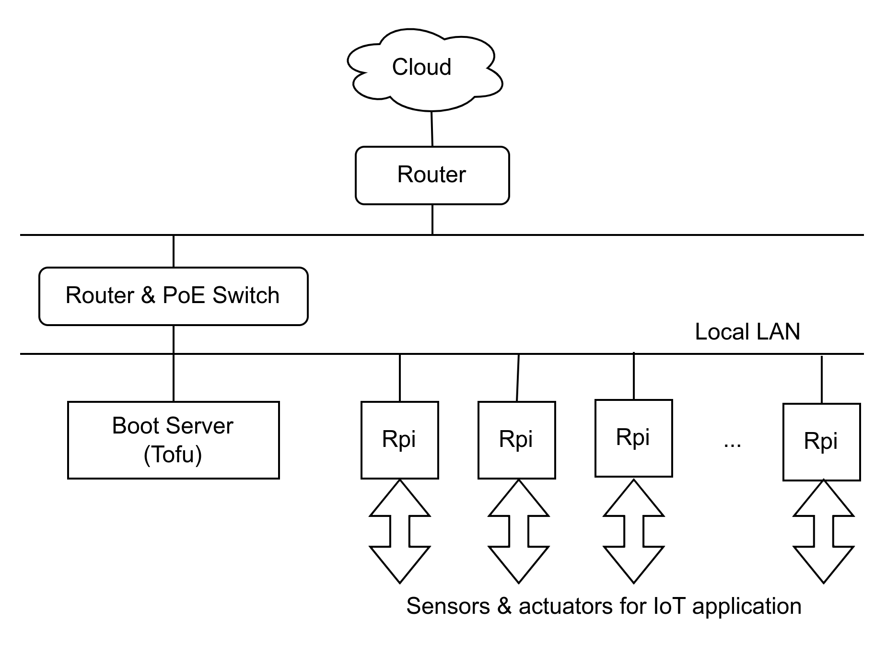

# Iot Tofu

This is an IoT development platform using:

- hardware based on Raspberry Pi CM4 mounted on the Tofu board, as shown below,
- a backend API generated by IBM LoopBack4 framework,
- an IoT OS support for the API and the corresponding boot backend, and
- several frontends based on HomeAssistant framework as an example.

The RPis should not depend on their unreliable SD disks for system disk. Instead, the SSD disk from the dedicated boot server will be used remotely in a local LAN.


## IoT Distributed Architecture

The architecture, based on [raspberrypi.com](https://www.raspberrypi.com/documentation/computers/remote-access.html#using-pxetools), considers a distributed network connected through the cloud, composed of 'regions'. Each 'region' has a local LAN powered by PoE (Power over Ethernet) that connects the boot server and several RPis. Each RPi may have sensors & actuators for an IoT (Internet of Things) application.

#### IoT Region with Boot Server for Rpis



- Each 'region' has a local LAN that includes a boot server handling several RPis.
- Tofu is the boot server for all RPis in the regional LAN.
- Each RPi has sensors & actuators for an Internet of Things application.
- Each region connects to the main network & then to the cloud.
- Local LAN for each Region
  - router: dedicated LAN for Tofu & RPis (192.168.10.1 for example)
  - dns: nameserver 127.0.0.1 to force using dnsmasq dns
- Main LAN connected to the Cloud
  - router: connected to Internet (gateway 192.168.1.254 for example)
  - dns: 192.168.1.254 to be set at dnsmasq server

## Boot-Back

This is the backend. It may run on x86-64 machines for development but the final app runs on the Tofu Raspberry Pi.

### LoopBack 4

The backend is generated using [LoopBack 4 CLI](https://loopback.io/doc/en/lb4/Command-line-interface.html), please check out the [README](src/README.md). As shown below, the LB4 provides automatic generation of a swagger-like frontend showing all the API details. It runs on both x86 (for development) and arm64 (for production) hardware.


Note: The current version did not complete the backend yet, since it was waiting for the IoT OS that just finished.

## IoT OS

The code in the 'rpi' folder is expected to be executed by the boot server and RPis. It provides the IoT OS support for the API and the corresponding boot backend, based on the remote boot architecture described on [raspberrypi.com](https://www.raspberrypi.com/documentation/computers/remote-access.html#using-pxetools).

### Operating instructions

The IoT OS is installed at the boot server. After initial setup, it is possible to add & remove RPis to the local LAN, based on their serial numbers. The following workflow may be commanded manually but it is expected to be soon incorporated to Boot-Back.

```
# clone the repo
git clone git@github.com:josemotta/iot-tofu.git
cd iot-tofu

# install just once the services
rpi/pxetools-install.sh

# do the initial setup
rpi/pxetools-setup.sh

# then start adding, listing, and removing RPis by serial number
sudo pxetools --add 9f55bbfd
sudo pxetools --add a10cd2e5

sudo pxetools --list
Serial      Owner    Name    MAC                IP
----------  -------  ------  -----------------  ---------
0x9f55bbfd  jo       rpi4    b8:27:eb:55:bb:fd  Not found
0xa10cd2e5  jo       rpi2    b8:27:eb:0c:d2:e5  Not found

sudo pxetools --remove 9f55bbfd
sudo pxetools --remove a10cd2e5
```

It is also possible to delete all RPis and reset the current setup. Please see the following workflow:

```
# reset deletes all RPis from the boot server
rpi/pxetools-reset.sh

# it is possible to reinitiate setup and repeat the process again
rpi/pxetools-setup.sh
sudo pxetools --add 9f55bbfd
sudo pxetools --add a10cd2e5
```

## Home-Assistant

There are frontend websites for RPis created by the well known [Home Assistant](https://www.home-assistant.io/).
