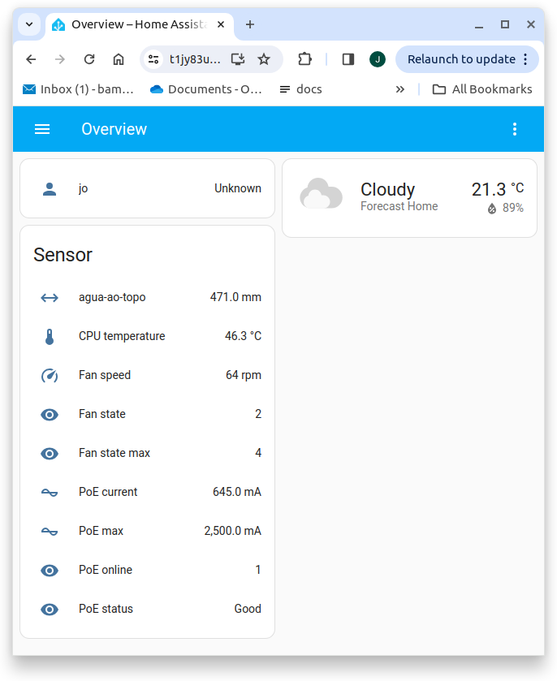

# TOFU Homeassistant

This is the default setup for TOFU Homeassistant.

TOFU Homeassistant is actually a 'super' Homeassistant, since local LAN grants full access to the APIs published by all RPis. To exemplify, the Homeassistant 'distance' sensor includes a rest definition that can be appended to the current TOFU Homeassistant configuration using the commands shown below:

```
git clone https://github.com/josemotta/iot-tofu
cd iot-tofu/region
sudo install.sh
sudo installalias.sh     #get shorter Docker commands

```

This is a typical [configuration](configuration.yaml) for the **Tofu boot server**. As shown by the [sensors.yaml](sensors.yaml), it is possible to configure calls to APIs running on the RPis, since they are directly accessed through the local LAN. It also extracts raw sensors data (temperature & current) from files as part of the Sysfs interface.



This configuration is supported by [vl53l1x](../rpi/vl53l1x/). The VL53L1X is a state-of-the-art, Time-of-Flight (ToF) laser-ranging sensor. It is the fastest miniature ToF sensor on the market with accurate ranging up to 4 m and fast ranging frequency up to 50 Hz.

### PoE HAT Fan Speeds

dtparam=poe_fan_temp0=55000 # 55°C (fan on at low speed)
dtparam=poe_fan_temp1=60000 # 60°C (medium speed)
dtparam=poe_fan_temp2=65000 # 65°C (high speed)
dtparam=poe_fan_temp3=70000 # 70°C (full speed)

Check how to [configure](https://www.jeffgeerling.com/blog/2021/taking-control-pi-poe-hats-overly-aggressive-fan) Pi's /boot/config.txt to control the speeds and temperatures when the fan runs on the PoE HAT.

After editing the file, you must reboot the Raspberry Pi for the changes to take effect.
