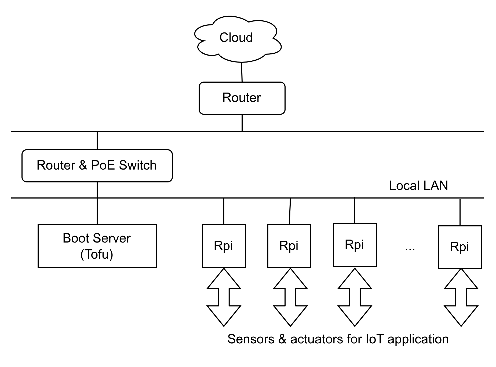

# IoT OS

This section considers an existing network conected to the cloud, composed of 'regions'.



#### IoT Region with Boot Server for Rpis

- Each 'region' has a local LAN powered by Power over Ethernet (PoE) that connects the boot server and several RPis at distances up to 100 m, according to the PoE standard.
- Each RPi is capable of controlling sensors & actuators for an IoT (Internet of Things) application located within a 5 m range using I2C (Inter-Integrated Circuit) protocol.

The code in this folder is expected to be executed by the boot server and RPis. The IoT project expects to run docker containers in all them. The RPis 3 & 4 models do not depend on their unreliable SD disks for system disk. Instead, the SSD disk from the dedicated boot server will be used remotely in the regional LAN.

This folder provides the IoT OS support for the API and the corresponding boot backend. The scripts are based on the remote boot architecture described on [raspberrypi.com](https://www.raspberrypi.com/documentation/computers/remote-access.html#using-pxetools). Some scripts are supposed to be activated directly by the API primitives. Others are just guidelines for the API code. During the development, the scripts were tested successfully using command lines.

## Operating instructions

The only requirement is that the boot server should initiate with the latest RPI OS installed. The IoT Boot API & Services are installed just once at the boot server. After the initial setup, it is then possible to start adding & removing RPis to the local LAN, based on their serial numbers. This workflow is shown below:

```
# clone the repo
git clone git@github.com:josemotta/iot-tofu.git
cd iot-tofu

# install just once the services
rpi/pxetools-install.sh

# do the initial setup
rpi/pxetools-setup.sh

# then start adding, listing, and removing RPis by serial number
sudo pxetools --add 9f55bbfd
sudo pxetools --add a10cd2e5

sudo pxetools --list
Serial      Owner    Name    MAC                IP
----------  -------  ------  -----------------  ---------
0x9f55bbfd  jo       rpi4    b8:27:eb:55:bb:fd  Not found
0xa10cd2e5  jo       rpi2    b8:27:eb:0c:d2:e5  Not found

sudo pxetools --remove 9f55bbfd
sudo pxetools --remove a10cd2e5
```

It is also possible to delete all RPis and reset the current setup. Please see the following workflow:

```
# reset deletes all RPis from the boot server
rpi/pxetools-reset.sh

# it is possible to reinitiate setup and repeat the process again
rpi/pxetools-setup.sh
sudo pxetools --add 9f55bbfd
sudo pxetools --add a10cd2e5
```
