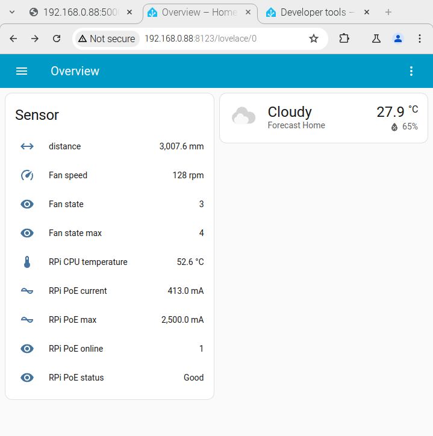
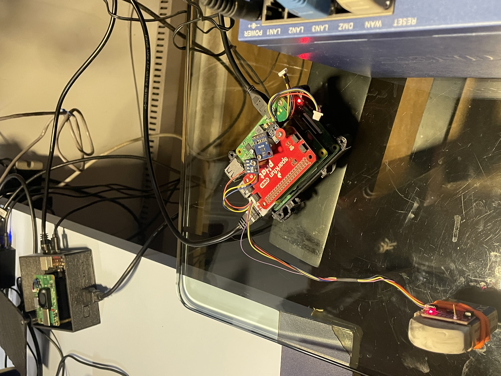
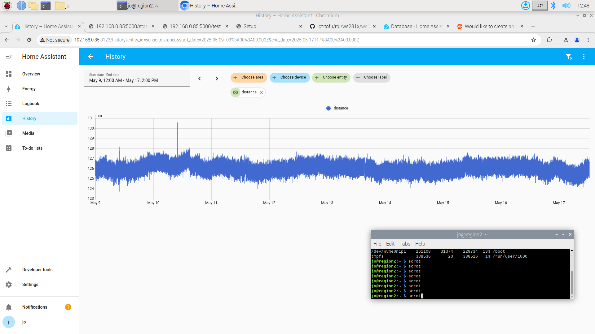

# Homeassistant

## VL53L1X Time-of-Flight (ToF) laser-ranging sensor.

The VL53L1X is a state-of-the-art, Time-of-Flight (ToF) laser-ranging sensor, enhancing the ST FlightSense product family. It is the fastest miniature ToF sensor on the market with accurate ranging up to 4 m and fast ranging frequency up to 50 Hz.

The Homeassistant 'distance' sensor includes a rest definition that can be appended to the current Homeassistant configuration using the commands shown below:

```
git clone https://github.com/josemotta/iot-tofu
cd iot-tofu/rpi/vl53l1x/ha
sudo install-ha.sh

```

This is an example of a typical [configuration](configuration.yaml) file, expected to be **installed at RPIs** with proper sensor, not at Tofu boot server. It also extracts raw sensors data (temperature & current) from files as part of the sysfs interface. The HomeAssistant Overview page for VL53L1X Time-of-Flight (ToF) laser-ranging sensor is shown below.



### Light interference

A test near a window, even without direct sun exposure, shows that VL53L1X sensor is affected by daylight, ranging from small variations of 1 cm during the night until up to 5 cm during the day time. The sensor shown below was aimed at the ceiling to measure a 2.2 m distance.


### Screenshots





