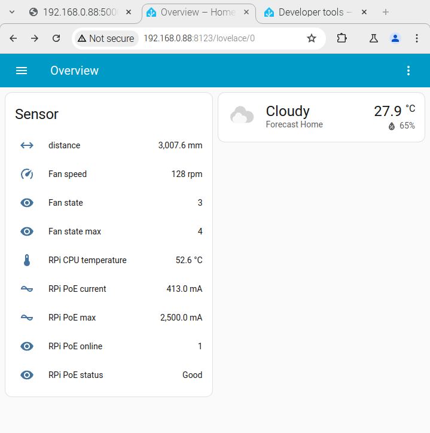
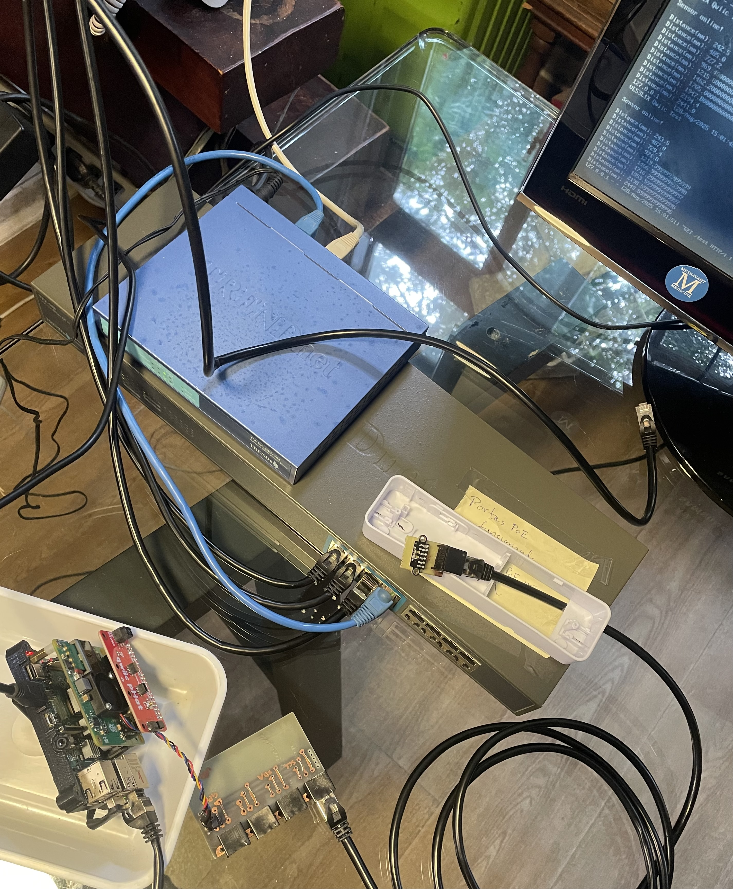
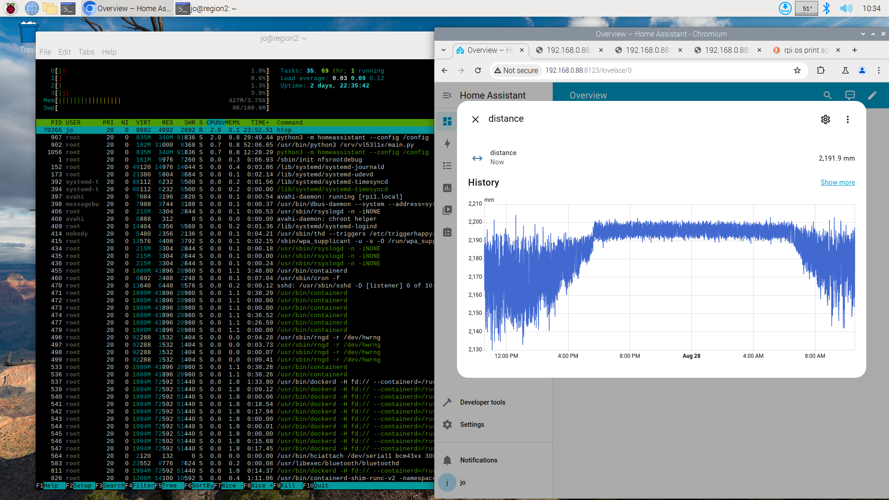
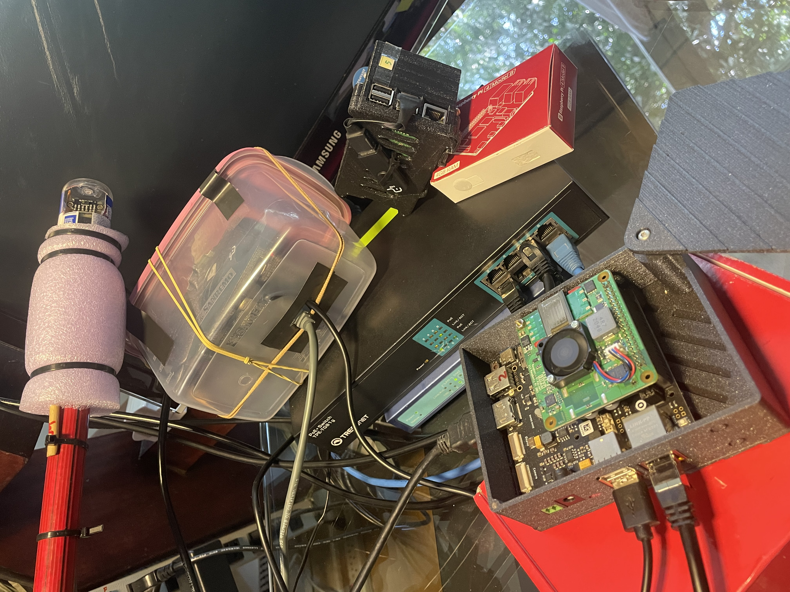
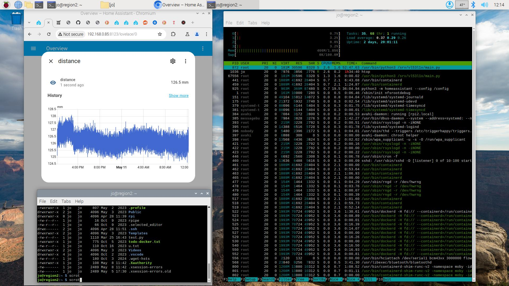
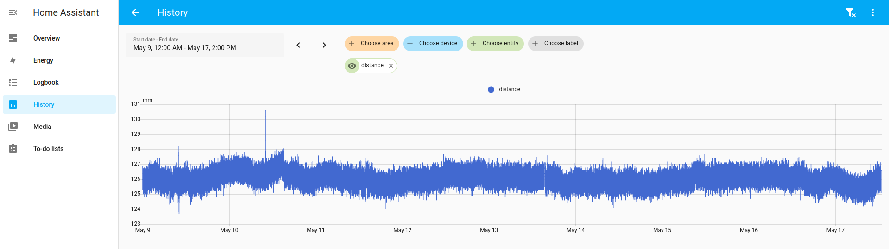
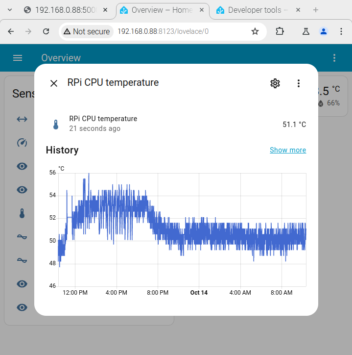
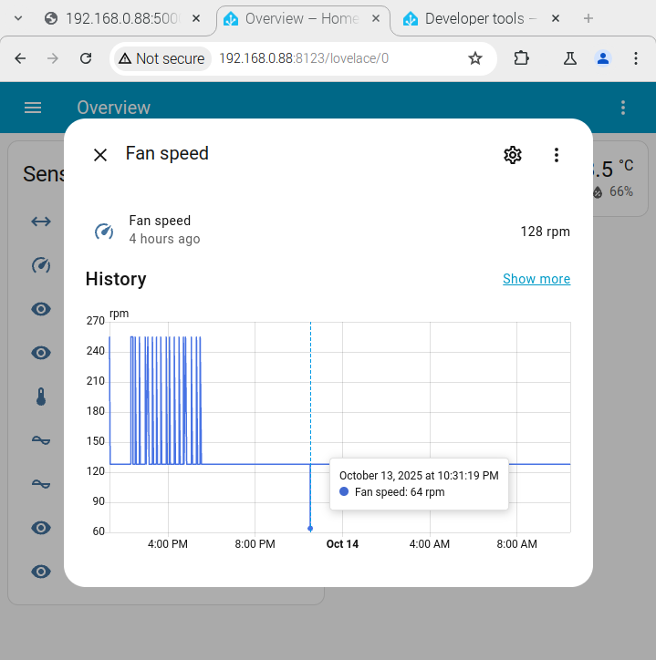

# Homeassistant

## VL53L1X Time-of-Flight (ToF) laser-ranging sensor.

The VL53L1X is a state-of-the-art, Time-of-Flight (ToF) laser-ranging sensor, enhancing the ST FlightSense product family. It is the fastest miniature ToF sensor on the market with accurate ranging up to 4 m and fast ranging frequency up to 50 Hz.

The Homeassistant 'distance' sensor includes a rest definition that can be appended to the current Homeassistant configuration using the commands shown below:

```
git clone https://github.com/josemotta/iot-tofu
cd iot-tofu/rpi/vl53l1x/ha
sudo install-ha.sh

```

This is an example of a typical [configuration](configuration.yaml) file, expected to be **installed at RPIs** with proper sensor, not at Tofu boot server. It also extracts raw sensors data (temperature & current) from files as part of the sysfs interface. The HomeAssistant Overview page for VL53L1X Time-of-Flight (ToF) laser-ranging sensor is shown below.



### Light interference

A test near a window, even without direct sun exposure, shows that VL53L1X sensor is affected by daylight, ranging from small variations of 1 cm during the night until up to 5 cm during the day time. The sensor shown below was aimed at the ceiling to measure a 2.2 m distance.





### Prototype for burn-in tests

A custom 3D printed case was built for five prototypes, two of them are shown in the picture below:

- Rpi#5 is loose & disconnected on the right, showing the RJ-45 connector that powers & connects it to the local LAN. It shows also the external USB pen drive, needed to store Docker containers that do not support the remote boot disk.

- Rpi#1 prototype is being used for burn in tests and is expected to participate in the first official mission. It is fixed by DIN rail inside the pink waterproof plastic box. It is wired to PoE+ switch together with Tofu and both are powered by local LAN, up to a 100 meters away from PoE+ LAN switch. There are also four RJ-45 connectors in the 3D printed case specially designed for I2C pins to connect the VL53L1X sensor and/or other I2C devices.

- Looking up, fixed on the top of a wood stick, we see the VL53L1X sensor protected by a plastic cover. It is supposed to be installed pointing down inside a big water tank to continuosly measure the water level 24 hours/day.



### Screenshots








